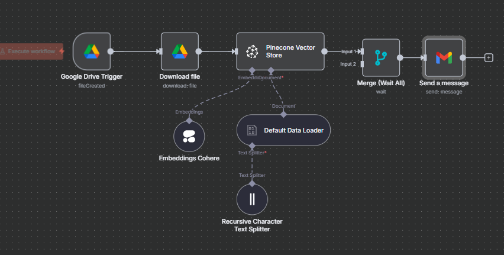

# n8n Lead Capture & Knowledge Base Automation

This repository contains two **n8n workflows** designed to automate document knowledge management and lead capture. The workflows integrate Google Drive, Pinecone, email notifications, a chatbot, and Google Sheets to create a seamless pipeline for knowledge retrieval and lead generation.

---

## 📌 Workflows Overview

### 1. Google Drive → Pinecone Embedding → Email Notification  
**Workflow:** `drive-to-pinecone.n8n.json`  

This workflow ensures that your knowledge base is always up to date.  
- **Trigger:** Runs whenever a file in Google Drive is created.  
- **Steps:**  
  1. Detects changes in Google Drive.  
  2. Extracts and embeds file content into **Pinecone vector database** for semantic search.  
  3. Sends an **email notification** confirming the update.  

**Use Case:**  
Keeps your knowledge base synced with the latest documents automatically.

---

### 2. Chatbot → Knowledge Base → Lead Capture (Google Sheets)  
**Workflow:** `chatbot-lead-capture.n8n.json`  

This workflow handles **chat interactions** while capturing potential leads.  
- **Trigger:** Runs when a new chat message is received.  
- **Steps:**  
  1. Retrieves answers from the Pinecone-powered knowledge base.  
  2. Responds to the user with the correct answer.  
  3. Captures **lead details (Name, Email, Phone)**.  
  4. Saves the captured leads into **Google Sheets** for tracking.  

**Use Case:**  
Acts as a **smart chatbot** that not only provides answers but also builds a **lead database** in real time.

---

## 🖼️ Screenshots  

### Google Drive to Pinecone Workflow  

### Chatbot Knowledge Base & Capture Leads and save to googlesheets 

### Whole workflow

---

## ⚙️ Tech Stack  
- **n8n** – Workflow automation  
- **Google Drive** – Document storage  
- **Pinecone** – Vector database for embeddings  
- **Google Sheets** – Lead management  
- **Email (SMTP/Gmail)** – Notifications  

---

## 🚀 Getting Started  

### Prerequisites  
- [n8n](https://n8n.io) instance (self-hosted or cloud)  
- API keys and credentials for:  
  - Google Drive  
  - Pinecone  
  - Google Sheets  
  - Email provider  

##  Setup & Usage Guide

### Prerequisites:
-  n8n instance (self-hosted or n8n Cloud)
- Google Drive, Gmail, and Google Sheets credentials configured in n8n
- Pinecone API key and index created
- Embedding model credentials (e.g., Cohere, OpenAI, etc.)

### Import & Configure Workflows:
1. **Import** both workflow JSON files into your n8n instance.
2. Configure credentials for:
   - Google Drive (for file trigger & downloads)
   - Google Sheets (Lead storage)
   - Gmail (Notification emails)
   - Pinecone (Vector store)
   - AI embedding model (e.g., Cohere)
3. Double-check node connections:
   - Ensure file input flows through splitter → loader → embeddings → Pinecone.
   - In the chat workflow, confirm AI Agent is linked to the vector store.
4. Optionally include a **Merge (Wait All)** node before the email to prevent multiple emails.
5. **Activate** both workflows and test:
   - Upload a document to Drive to test Workflow 1.
   - Ask a question via chat to test Workflow 2.

##  Contact
Created by **Nathe (Natnael M.)** — n8n & automation specialist  
- Email: natnaelm552@gmail.com  
- Portfolio: [nathe-works.netlify.app](https://nathe-works.netlify.app)  
- LinkedIn / Upwork: Available on request  
